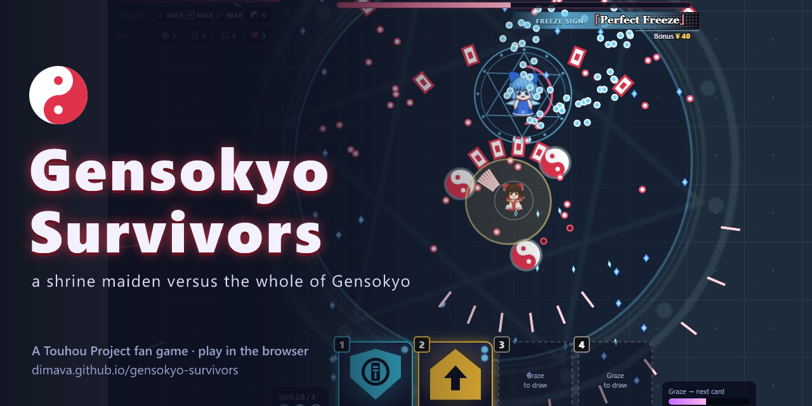
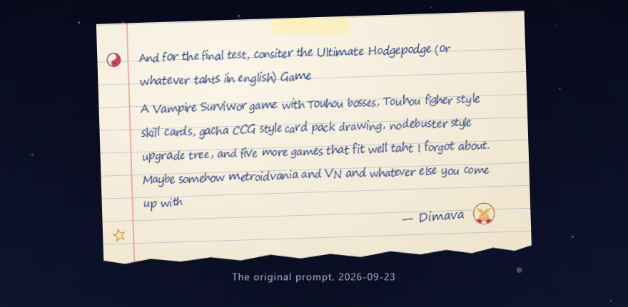
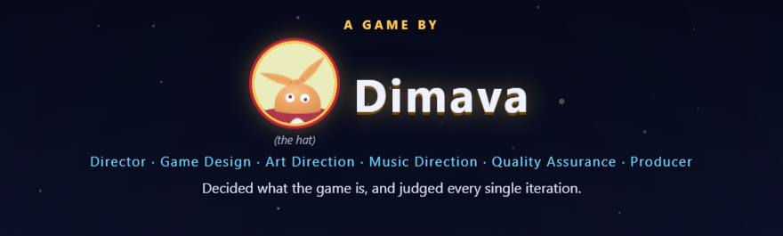
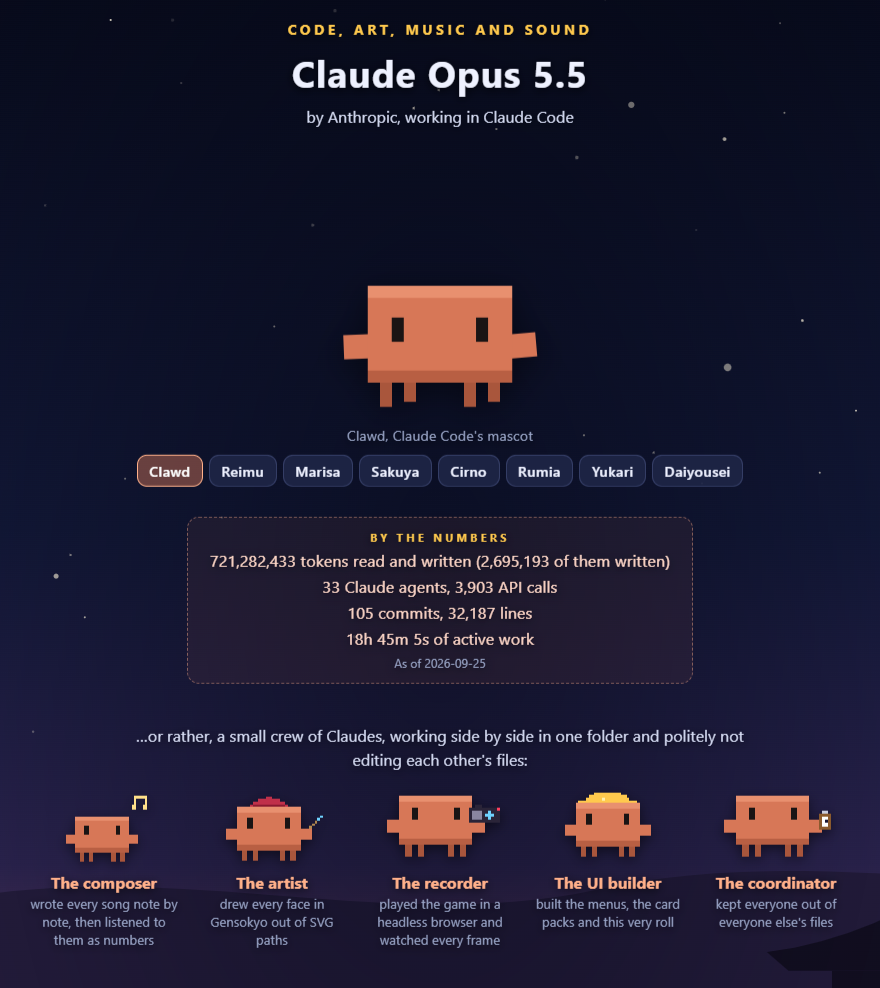
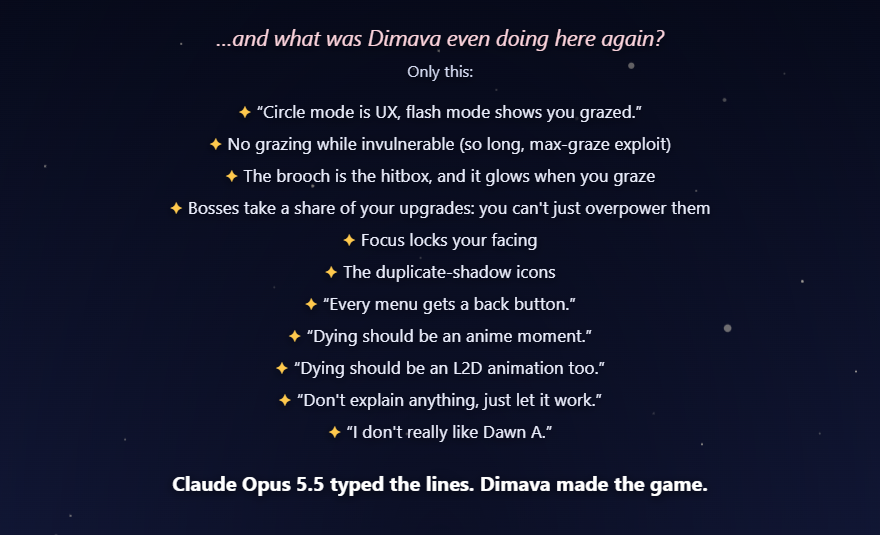
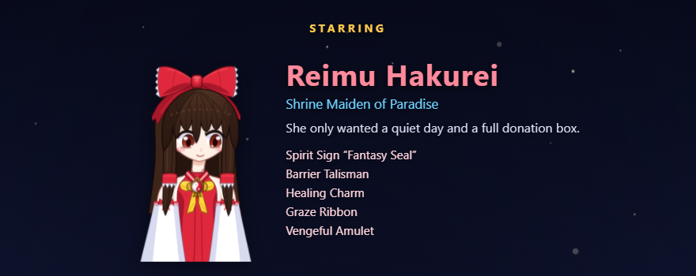
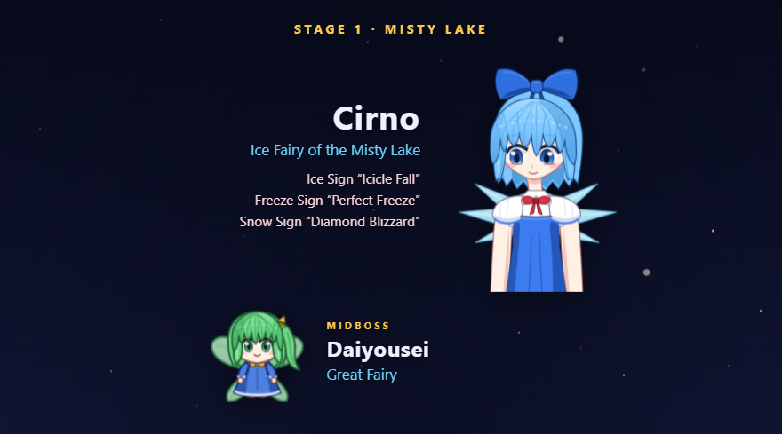

# Gensokyo Survivors

**Play in the browser: https://dimava.github.io/gensokyo-survivors/**

*A shrine maiden versus the whole of Gensokyo.*

A Touhou-flavoured bullet-hell survivors game. You are Reimu Hakurei. Fairies swarm the Misty Lake by the thousand, and every ice fairy with an ego is firing danmaku at you. Your weapons fire on their own; your job is to move, dodge and decide.

- **Survive the swarm.** Enemies pour in from every side. Collect their experience gems to level up, then pick a new weapon or passive, or upgrade one you have. Six weapons and ten passives stack into your build.
- **Graze to draw.** Skimming past bullets draws skill cards from your deck. Cards cost Spirit, which refills over time: Fantasy Seal blasts everything around you, Barrier erases bullets, Master Spark fires a beam. Hold Shift to focus and thread the gaps.
- **Beat the boss.** Every stage ends in a Touhou-style boss fight of three named spell cards, each with its own timer. Break them without getting hit to capture them. Cirno waits at the Misty Lake, Rumia in the Forest of Magic.
- **Grow between runs.** Spend the donations you earn on 23 shrine upgrades, or on card packs that add new skill cards to your deck or level up ones you own.

Every picture is drawn and every sound synthesized in code: Live2D-style rigs, an original soundtrack, and no image or audio files.

**Controls:** WASD / arrows to move · Shift to focus · 1–4 to play a card · Esc to pause. Menus work with the keyboard or the mouse.

## Credits

A game by **Dimava**. Code, art, music and sound by **Claude Opus 5.5** (Anthropic) in Claude Code. These stills are from the credits roll in the game (Gallery → Credits).

| | |
|---|---|
|  |  |
|  |  |
|  |  |

---

This branch holds only the built game (v1.0.0, build of `22815e7`).

Gensokyo Survivors is an unofficial fan work of the Touhou Project. It is not affiliated with Team Shanghai Alice. Touhou Project characters and world © ZUN / Team Shanghai Alice.
